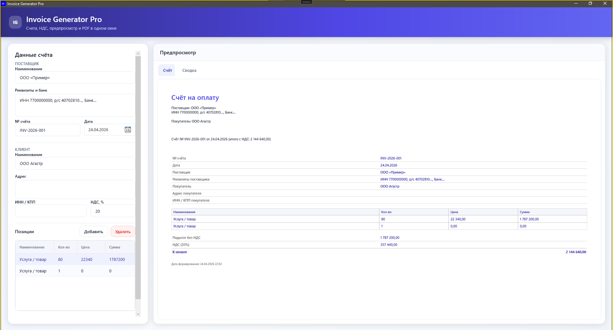
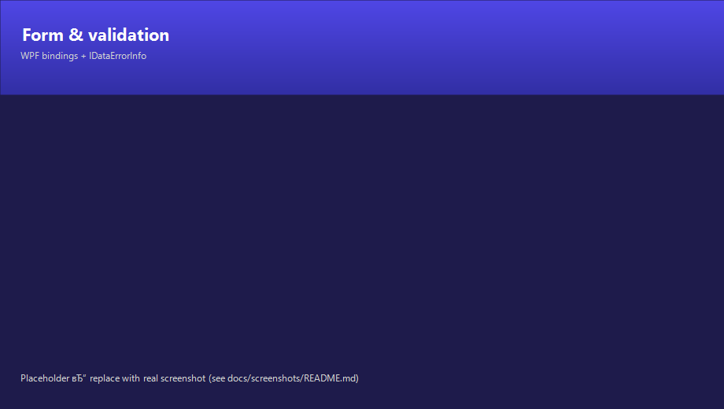
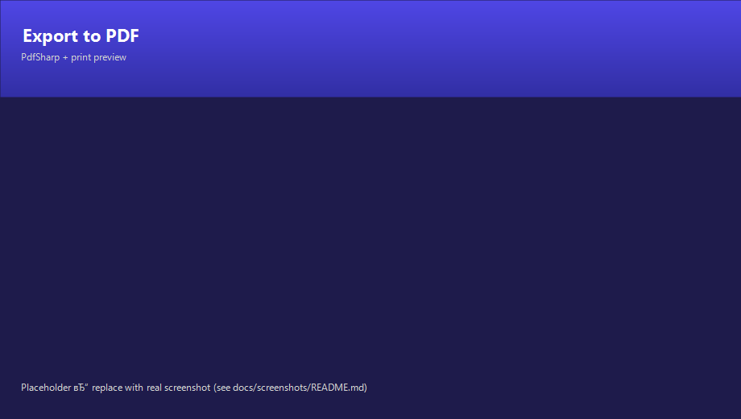

# Генератор счетов Pro

Настольное **WPF** приложение для создания счетов-фактур: поля поставщика и клиента, позиции, **НДС**, предварительный просмотр в реальном времени, **печать** и **экспорт в PDF**. Строки интерфейса на русском языке.

**Стек технологий**
 .NET 8, WPF, MVVM, [PdfSharp](https://docs.pdfsharp.net/) 6.x, [Handlebars.Net](https://github.com/Handlebars-Net/Handlebars.Net) |

**Платформа** | Windows (`net8.0-windows`) |

## Скриншоты








## Требования

- **Windows** 10/11 (рекомендуется x64).

- Для **сборки из исходного кода**: [.NET 8 SDK](https://dotnet.microsoft.com/download/dotnet/8.0) (включает рабочую нагрузку для WPF).

- Чтобы **запустить опубликованную сборку** из [Releases](https://github.com/YOUR_USER/InvoiceGeneratorPro/releases): отдельная среда выполнения не требуется, если вы используете **самодостаточный** ZIP-архив (см. ниже).

## Сборка и запуск (из исходного кода)

```bash
cd InvoiceGeneratorPro
dotnet build
dotnet run
```

Или откройте `InvoiceGeneratorPro.sln` в Visual Studio / Rider и запустите проект **InvoiceGeneratorPro**.

**Первая сборка:** MSBuild запускает [Resources/BuildIcon.ps1](Resources/BuildIcon.ps1) (Windows PowerShell 5.1) для генерации `Resources/AppIcon.ico`.

## Сторонние лицензии

В этом проекте используются **PdfSharp** и **Handlebars.Net**; см. соответствующие лицензии на NuGet. Лицензия проекта: [ЛИЦЕНЗИЯ](ЛИЦЕНЗИЯ) (MIT).

---

## Краткое (RU)

Настольное приложение для счетов: НДС, предпросмотр, печать, PDF.